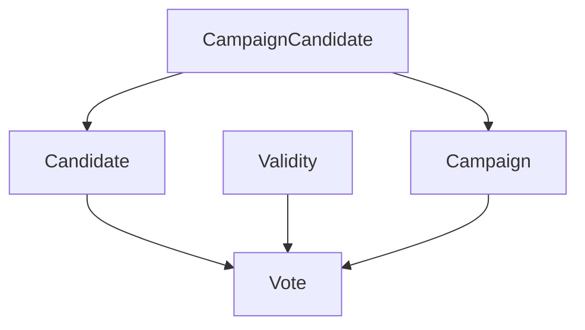

# TECH SPEC

This TECH SPEC documents design decisions and reasoning.

## Pre-requisites.

1. This application is a Minimal Viable Version.

2. Performance optimisation is required.

    * Caching to quicken application load speed.

    * Query improvement to reduce complete database iteration.

3. Pagination.

    * As data sets grow and to work with existing queries return batches.

4. Styling.

    * Create CSS classes for SEO optimisation.

5. SEO optimisation.

    * Providing meta data plus backlinks and keywords would be realistic.

5. More TBD but these are items that I am aware of.

## Controller

### `CampaignController`.

* `app/controllers/campaigns_controller.rb`.

1. 'Parent' inheritance.

    * All associated Rails collections inherit from the `Campaign` model.

    * Child data is available `through` an individual `Campaign`.

2. Two controller actions to READ as complete CRUD is not required.

    * `index`.

        * Query `campaigns` plural.

    * `show`.

        * Query `Campaign` singular.

## Database Schema.

* `db/schema.rb`.

## Models

### `Campaign`.

* `app/models/campaign.rb`.

1. Attributes.

    * `episode`.

        * `Campaign` identifier as `string`.

2. Validations.

    * `episode`.

        * `presence` `true`.

            * `Campaign` is not created with `nil` `episode` value.

        * `uniqueness` `true`.

            * `Campaign` is created once without sequential duplicates having identical `episode` values.

### `Candidate`.

* `app/models/candidate.rb`.

1. Attributes.

    * `name`.

        * `Candidate` identifier as `string`.

2. Validations.

    * `name`.

        * `presence` `true`.

            * `Candidate` is not created with `nil` `name` value.

        * `uniqueness` `true`.

            * `Candidate` is created once without sequential duplicates having identical `name` values.

### `Vote`.

* `app/models/vote.rb`.

1. Attributes.

    * `external_identifier`.

        * `Vote` identifier as `integer`.

            * `epoch` timestamp raw format to create `Vote`.

            * Not `datetime` as not required for views.

2. Validations.

    * `external_identifier`.

        * `presence` `true`.

            * `Vote` is not created with `nil` `external_identifier` value.

### `Validity`.

* `app/models/validity.rb`.

1. Attributes.

    * `measure`.

2. Validations.

    * `measure`.

        * `presence` `true`.

            * `Validity` is not created with `nil` `measure` value.

        * `uniqueness` `true`.

            * `Validity` is created once without sequential duplicates having identical `measure` values.

## `rake` Task.

* `lib/tasks/import_votes.rake`.

* `lib/assets/votes.txt`.

1. Imports `Vote` data into the application from a `.txt` file.

    * A line is represents a singular `Vote`.

    * Chosen values are processed when required for model attributes whereas the remaining are overlooked.

    * An `ActiveRecord::Base.transaction` is protected by a `rescue` block to prevent failure against errors raised by model validation and then rollback invalid database transactions.

2. Aggregates processed lines into seperate valid or invalid `.csv` files.

    * These files are created within data import and are updated through the process.

    * `lib/assets/invalid_votes.csv`.

        * Invalid `votes` with raised `ActiveRecord` model validation error that can be imported into a CSV tool to visualise.

        * CSV Headers.

            * 'Time'.

                * `Vote` `epoch` time.

            * 'Campaign'.

                * `Campaign` `episode`.

            * 'Validity'.

                * `Validity` `measure`.

            * 'Choice'.

                * `Candidate` `name`.

            * 'Error'.

                * `ActiveRecord` model validation error.
    
    * `lib/assets/valid_votes.csv`.

        * Valid `votes` that can be imported into a CSV tool to visualise.

        * CSV Headers.

            * 'Time'.

                * `Vote` `epoch` time.

            * 'Campaign'.

                * `Campaign` `episode`.

            * 'Validity'.

                * `Validity` `measure`.

            * 'Choice'.

                * `Candidate` `name`.

3. Prints progress outputs to command line.

    * `print("START - processing votes. \n")`.

        * Before lines are processed.

    * `print("END - processing votes. \n")`.

        * After lines are processed.

    * `print("#{votes} votes were processed. \n")`.

        * Count of lines processed.

        * Expected as equal to line count within `.txt` file.

    * `print("#{invalid_votes} votes were not imported because they were invalid: \n #{invalid_votes_path} \n")`.

        * Count of valid lines processed.

        * Path to `lib/assets/invalid_votes.csv` file to view outcome.

        * Count added to `valid_votes` count is expected as equal to line count within `.txt` file.

    * `print("#{valid_votes} votes were imported because they were valid: \n #{valid_votes_path} \n")`.

        * Count of invalid lines processed.

        * Path to `lib/assets/valid_votes.csv` file to view outcome.

        * Count added to `invalid_votes` count is expected as equal to line count within `.txt` file.

4. Reusable when new lines are added to the `.txt` file.

    * `.find_or_create_by!` model method raises model validation errors through `!`.

    * This query reads or creates when an entity does or does not exist.

    * New lines added will be created whereas entities for pre-processed lines will not be duplicated.

## Routes.

* `config/routes.rb`.

### `resources :campaigns`.

1. Creates all CRUD routes for the `Campaign` model even though the application only utilises READ functionality.

    * Independent routes were not applied because `resources` entitles the use of `path` helpers within views.

## Views.

### `campaigns#index`.

*  `app/views/campaigns/index.html.erb`.

1. Displays 'Episodes do not exist.' and 'Have you imported Vote data?' when `import_votes` `rake` task has not been executed from command line.

    * Remind User to import `Vote` data.

2. List `campaigns` after data import with 'View' link.

    * `campaigns` are identified by `episode`.

    * 'View' link to redirect to `campaigns#show` view.

### `campaigns#show`.

*  `app/views/campaigns/show.erb`.

1. Displays 'Candidates do not exist' and 'Not available.' when `import_votes` `rake` task has not been executed from command line.

    * Remind User to import `Vote` data.

2. List `candidates` and `Vote` counts.

    * `candidates` are identified by `name`.

    * `Vote` counts are grouped by `Pre` / `Post` `Validity` `measure` and `During` `Validity` `measure`.

## Styling.

* `app/assets/stylesheets/application.css`.

1. Styles are appended directly to elements for faster delivery.

2. Cygnetise brand inspiration, colour scheme and similar font.
