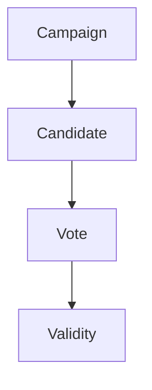

# TECH SPEC

This TECH SPEC documents design decisions and reasoning.

## Models

* `Campaign`.

    * Attributes.

        * `episode`.

* `Candidate`.

    * Attributes.

        * `name`.

* `Vote`.

    * Attributes.

        * `external_identifier`.

* `Validity`.

    * Attributes.

        * `measure`.

## Relations

